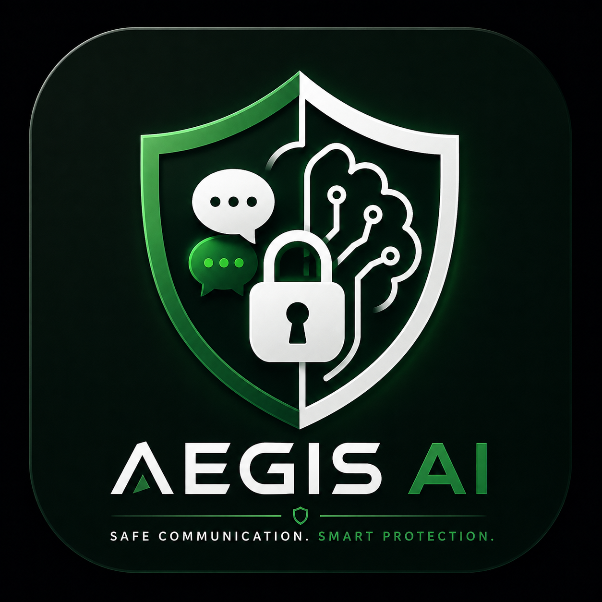

Aegis AI

AI-Powered Communication, Safety & Threat Intelligence

Protecting conversations. Detecting threats. Keeping people in control.

  <a href="#-overview">Overview</a> •
  <a href="#-key-features">Features</a> •
  <a href="#-how-it-works">How It Works</a> •
  <a href="#-technology-stack">Tech Stack</a> •
  <a href="#-installation">Installation</a> •
  <a href="#-roadmap">Roadmap</a>

---

🛡️ Overview

Aegis AI is an AI-powered communication and personal safety platform designed to make digital communication safer.

Modern communication platforms make it easy to connect, but they also expose users to threats such as phishing, scams, harassment, blackmail, malicious content, and suspicious messages.

Aegis AI introduces an intelligent safety layer that can analyze potentially harmful content, identify suspicious patterns, assess risk, and provide users with understandable safety guidance.

«Aegis AI is designed to assist users — not replace their judgment or control over their decisions.»

---

🎯 Problem

Digital communication can expose users to different forms of online abuse and fraud:

- Phishing and fraudulent messages
- Online scams
- Harassment and abusive communication
- Blackmail and threatening messages
- Suspicious links
- Social engineering attempts
- Malicious or potentially dangerous content

Traditional communication systems often focus on delivering messages rather than helping users understand whether a message may be dangerous.

Aegis AI's Approach

Aegis adds an AI-powered safety intelligence layer to communication.

Instead of simply telling a user that something is "safe" or "unsafe", the system is designed to help explain:

What was detected → Why it may be risky → What the user can do next

---

✨ Key Features

🤖 AI Safety Analysis

Analyze potentially suspicious or harmful communication using AI-assisted threat detection.

Potential detection categories include:

- Phishing
- Scams
- Harassment
- Blackmail
- Threatening content
- Suspicious communication patterns

---

📊 Risk Assessment

Aegis AI can classify potentially dangerous content according to its assessed risk level.

Example conceptual levels:

Risk Level| Meaning
🟢 Low| No significant risk detected
🟡 Medium| Suspicious or potentially harmful
🔴 High| Strong indicators of malicious or threatening behavior

The goal is to provide context and reasoning, rather than an unexplained binary decision.

---

💬 Safe Communication

Aegis AI is designed around communication features such as:

- Messaging
- Group communication
- File sharing
- Communication assistance
- AI-powered safety analysis

---

🛡️ Aegis Guardian

The Aegis Guardian concept provides an intelligent safety layer for potentially dangerous communication.

It can assist users in understanding suspicious situations and provide appropriate safety guidance.

---

🚨 Safety Center

A dedicated safety area can provide users with:

- Safety guidance
- Emergency information
- Appropriate next-step recommendations
- Country-specific emergency resources

Aegis AI is designed to keep the user in control.

It does not automatically contact emergency services on the user's behalf.

---

🔐 Privacy & User Control

Privacy and user control are core design principles.

Aegis AI aims to ensure that safety assistance does not unnecessarily remove control from the person using the platform.

Key principles include:

- User-controlled actions
- Clear safety explanations
- Responsible AI usage
- Minimal unnecessary intervention
- Human decision-making for critical actions

---

⚙️ How It Works

The basic safety workflow is designed around the following process:

User Communication
        │
        ▼
   Content Input
        │
        ▼
 ┌─────────────────┐
 │   Aegis AI      │
 │ Safety Analysis │
 └─────────────────┘
        │
        ▼
 Threat / Risk Assessment
        │
        ├───────────────┐
        ▼               ▼
   Risk Level       Explanation
        │               │
        └───────┬───────┘
                ▼
          User Guidance
                │
                ▼
        User Makes Decision

The system is intended to make safety analysis understandable and actionable, rather than simply producing an unexplained AI response.

---

🧠 AI Safety Philosophy

Aegis AI follows a simple principle:

«AI should help people recognize danger, not take control away from them.»

For safety-critical situations, AI predictions should be treated as assistance, not absolute truth.

This means the platform should avoid presenting AI classifications as guaranteed facts.

---

🏗️ Technology Stack

The project is built as a modern web-based AI application.

Frontend

- Modern web UI
- Responsive design
- Component-based architecture
- Interactive communication interface

Backend

- API-based application architecture
- Authentication and authorization
- Data management
- AI service integration

AI Layer

- AI-assisted content analysis
- Threat classification
- Risk assessment
- Safety-oriented responses

Deployment

The project is designed to support modern cloud deployment workflows such as:

Development
     │
     ▼
 Git Repository
     │
     ▼
 Continuous Deployment
     │
     ▼
 Production Application

---

📁 Project Structure

The exact structure may evolve as development continues.

A typical structure is:

aegis-ai/
│
├── public/
│   ├── aegis-logo.png
│   └── assets/
│
├── src/
│   ├── components/
│   ├── pages/
│   ├── services/
│   ├── utils/
│   └── ...
│
├── README.md
├── package.json
├── .gitignore
└── ...

---

🚀 Installation

1. Clone the repository

git clone https://github.com/Rztech15/Aegis-AI.git

2. Enter the project directory

cd Aegis-AI

3. Install dependencies

npm install

4. Configure environment variables

Create a ".env" file according to the environment variables required by the current application.

Example:

AI_API_KEY=your_api_key_here

Never commit API keys, passwords, tokens, or other secrets to GitHub.

5. Start the development server

npm run dev

The application should then be available through the local development URL provided by the framework.

---

🔑 Environment Variables

Depending on the current implementation, environment variables may include:

Variable| Purpose
"AI_API_KEY"| AI service authentication
"DATABASE_URL"| Database connection
"JWT_SECRET"| Authentication security
"NEXT_PUBLIC_*"| Public frontend configuration

Only configure variables that are actually required by the current version of the project.

---

🔒 Security Considerations

Because Aegis AI deals with potentially sensitive communication, security is an important part of the project.

Recommended security practices include:

- Never expose API keys in frontend code
- Validate user input
- Sanitize untrusted content
- Secure authentication tokens
- Apply authorization checks
- Protect sensitive API endpoints
- Avoid storing unnecessary sensitive information
- Use HTTPS in production
- Keep dependencies updated

---

📱 User Experience

Aegis AI is designed to make safety information understandable to normal users.

Instead of overwhelming users with technical security terminology, the interface should communicate:

What happened?
       ↓
Why is it suspicious?
       ↓
How serious is it?
       ↓
What can I do?

This makes the AI safety layer useful even for users without cybersecurity knowledge.

---

🗺️ Roadmap

Phase 1 — Core Platform

- [x] Project foundation
- [x] Initial UI
- [x] Branding
- [x] AI integration foundation
- [ ] Production hardening

Phase 2 — AI Safety

- [ ] Advanced phishing detection
- [ ] Scam detection
- [ ] Harassment detection
- [ ] Threat detection
- [ ] Risk scoring improvements
- [ ] Explainable AI responses

Phase 3 — Communication

- [ ] Real-time messaging
- [ ] Group communication
- [ ] File sharing
- [ ] Enhanced safety controls

Phase 4 — Aegis Guardian

- [ ] Intelligent safety assistant
- [ ] Threat-context analysis
- [ ] Safety recommendations
- [ ] Improved incident guidance

Phase 5 — Safety Center

- [ ] Emergency information
- [ ] Regional safety resources
- [ ] User safety tools
- [ ] Incident assistance workflow

Phase 6 — Production

- [ ] Security audit
- [ ] Performance optimization
- [ ] Privacy review
- [ ] Reliability improvements
- [ ] Production monitoring

---

⚠️ Responsible AI Notice

Aegis AI is an AI-assisted safety system.

AI-generated classifications can be incorrect, incomplete, or affected by the available context.

Therefore:

- Aegis AI should not be treated as a definitive authority.
- High-risk situations should be evaluated carefully.
- Users should verify important information.
- Emergency situations should be handled through appropriate human or official channels.
- AI recommendations should not replace professional, legal, medical, or emergency assistance where such assistance is required.

---

🎓 Project Purpose

Aegis AI is also an exploration of how Artificial Intelligence, cybersecurity, software engineering, and human-centered design can be combined to address real-world problems in digital communication.

The project focuses on building technology that is not only intelligent, but also:

Explainable • Responsible • User-controlled • Security-focused

---

🤝 Contributing

Contributions, suggestions, and discussions are welcome.

Contribution workflow

git clone https://github.com/Rztech15/Aegis-AI.git

cd Aegis-AI

git checkout -b feature/your-feature

# Make your changes

git add .

git commit -m "Add: your feature"

git push origin feature/your-feature

Then open a Pull Request.

---

📄 License

This project is currently under development.

Add the project's chosen open-source license here when the licensing decision has been finalized.

---

👨‍💻 Developer

Muhammad Ramzan

BS Mathematics Student
AI • Data Analytics • Software Development

GitHub: "Rztech15" (https://reference-url-citation.invalid/0)

---

🛡️ Aegis AI

Intelligence for safer communication.

Built with AI, software engineering, and a focus on user safety.

